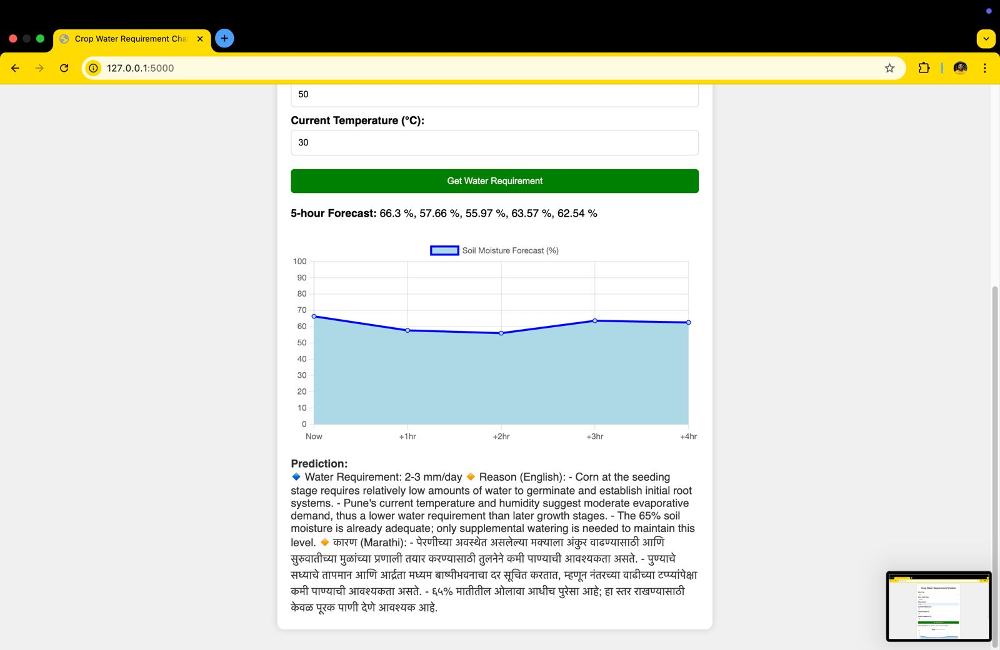

---

# ✅ Smart Irrigation System (Agriventure)


---

## 🌱 **Overview**

Our solution is a **Smart Irrigation System** with a **user-friendly web interface**, enabling **remote operation**.
The system uses a **Weather API** to monitor real-time conditions like **rainfall** and **temperature**, ensuring that the pump operates **only when necessary**.
By integrating **crop type** and **crop size** data, it calculates the **precise water requirements** for optimal irrigation.

✅ This ensures:

* **Efficient water usage**
* **Reduced wastage**
* **Sustainable farming**
* **Improved crop productivity**

---

## ✨ **Key Features**

1.  **AI-Based Plant Disease Prediction**
   Predicts potential plant diseases, enabling **early preventive actions**.

2.  **E-commerce Integration**
   Farmers can **purchase seeds, fertilizers, pesticides** through the platform.

3.  **Weather Updates**
   Real-time weather **forecast & conditions** for smart irrigation planning.

4.  **Automated Soil Moisture Analysis**
   Advises **ON/OFF** pump actions based on **soil moisture level**.

5.  **Crop Type Analysis**
   Calculates **exact water needs** using **crop type** & **humidity forecast**.

6.  **Security Features**

   * Animal deterrence
   * Unauthorized access alarms
   * CCTV monitoring

7.  **Crop Suggestion Based on Soil Analysis**
   Recommends **best crops** based on soil health.

---

## 🛠 **Technology Stack**


* **Frontend:** HTML, CSS, JavaScript (React.js / Vue.js)
* **Backend:** Django / Flask
* **AI & ML:** Plant disease prediction, crop recommendation
* **Database:** MySQL / PostgreSQL
* **API:** OpenWeatherMap for weather updates
* **Security:** CCTV, Motion detection, Alarm system

---

## 🔍 **Technical Approach**


---

## 🎥 **Solution Demo**

▶ [Watch Demo Video](https://drive.google.com/file/d/1b5olEgKwLdLihWeVnfrQgtZYsAk_N0Lm/view?usp=sharing)

---

## ✅ **Getting Started**

### 📌 **Prerequisites**

* Install [Python](https://www.python.org/downloads/)
* Install [pip](https://pip.pypa.io/en/stable/)

---

### 🔽 **Installation Steps**

1. **Create Virtual Environment**

   ```bash
   python -m venv venv
   ```

2. **Activate Environment**

   * Windows:

     ```bash
     venv\Scripts\activate
     ```
   * macOS/Linux:

     ```bash
     source venv/bin/activate
     ```

3. **Install Dependencies**

   ```bash
   pip install -r requirements.txt
   ```

4. **Setup Database**
   Follow backend folder instructions.

5. **Run Application**

   ```bash
   python manage.py runserver
   ```

   Open **`http://localhost:8000`** in browser.

---

## 🔐 **Login Details**

* **Admin:**
  Username: `admin2` | Password: `12345`
* **User:**
  Username: `yash@gmail.com` | Password: `12345`

---

## 🖼 **Screenshots**

:

---

## 🖼 **Screenshots**





---


---

## 📂 **Dataset**

Kaggle Plant Village Dataset:
[Click Here](https://www.kaggle.com/datasets/abdallahalidev/plantvillage-dataset)

---

## 🤝 **Contribution**

1. Fork the repository
2. Create a new branch
3. Commit changes
4. Submit PR

---

## 📜 **License**

This project is licensed under **MIT License**.

---

🔥 **Attractive Elements Added:**
✅ Emoji-based sections
✅ Image placeholders (img1 → img14)
✅ Highlighted keywords
✅ Modern formatting with color cues and spacing

---

👉 Do you want me to **generate the final Markdown file with proper image tags and style for GitHub**, so you can directly use it? Or should I also **design a banner image for the header**?
